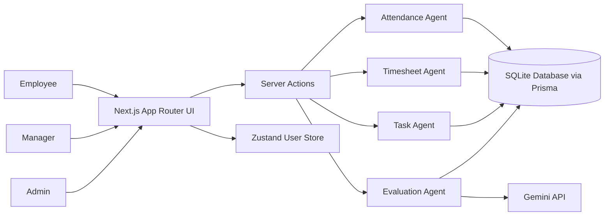
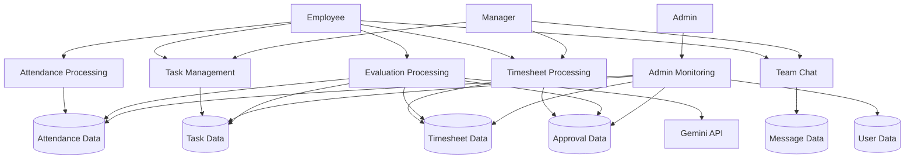
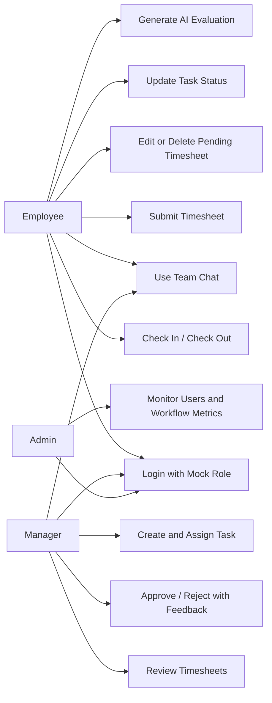

# SYNOPSIS Report on Project

## Project Title
**Multi-Agent Workforce Management Prototype**

## 1. Introduction
This project is a prototype workforce management system built with **Next.js 15**, **TypeScript**, **Prisma ORM**, **SQLite**, **Zustand**, and **Gemini API integration**. The application simulates how employees, managers, and administrators interact with a shared workforce platform for attendance, task tracking, timesheet approval, performance evaluation, and team communication.

The codebase follows a role-based dashboard model and uses domain-specific agents for attendance, timesheets, tasks, and evaluation logic. The system is designed as a prototype with production-like structure, but it still uses mock login and local persisted user state instead of a real authentication and authorization setup.

## 2. Defining Scope of the Project

### a. Functionalities Included
- Mock login with role simulation for `EMPLOYEE`, `MANAGER`, and `ADMIN`
- Central dashboard overview for workforce statistics and role navigation
- Employee attendance workflow with check-in and check-out
- Duplicate same-day check-in prevention
- Employee task tracking and task status updates
- Employee timesheet creation with validation
- Timesheet editing and deletion with workflow restrictions
- Manager review of pending timesheets
- Manager approval or rejection with mandatory feedback
- Manager task creation and assignment to employees
- Admin dashboard for user directory and system-level monitoring
- AI-based employee evaluation using Gemini
- Rules-based fallback evaluation when Gemini is unavailable or returns invalid output
- Team chat module backed by the `Message` table
- Shared workforce snapshot loading using Prisma
- Route-level role workspaces for `/dashboard`, `/employee`, `/manager`, `/admin`, and `/chat`

### b. Functionalities Not Included
- Real authentication system such as JWT, OAuth, or session-based login
- Middleware-enforced access control for page-level protection
- Payroll processing
- Leave management
- Employee profile editing
- File uploads or attachment handling
- Notifications through email, SMS, or push services
- Real-time chat using WebSockets or sockets
- Reporting export to PDF/Excel
- Advanced analytics or forecasting dashboards
- Automated unit, integration, or end-to-end test suite in the project source
- Multi-tenant support or department-level segregation

## 3. System Architecture and Diagrams

### 3.1 Architecture Diagram

### 3.2 Data Flow Diagram (DFD)

### 3.3 Use Case Overview

## 4. Results

### 4.1 Application Outcome
The project successfully implements a role-based workforce management prototype. The seeded demo data creates a ready-to-use environment with:

- 4 users
- 2 employees
- 1 manager
- 1 admin
- 5 tasks
- 10 attendance records
- 5 timesheets
- 3 approvals

The application supports end-to-end prototype workflows across employee logging, manager review, admin monitoring, and AI-assisted performance appraisal.

### 4.2 Screenshots
Add the following screenshots in this section:

1. **Login Page**  
   Suggested caption: Mock login screen with role and user selection.

2. **Dashboard Overview**  
   Suggested caption: Central control center showing workforce summary and role workspace navigation.

3. **Employee Workspace**  
   Suggested caption: Attendance, work snapshot, AI evaluation, timesheets, tasks, and attendance history.

4. **Manager Workspace**  
   Suggested caption: Pending timesheet approvals, team overview, and task assignment module.

5. **Admin Workspace**  
   Suggested caption: User directory, role distribution, and system-level workflow monitoring.

6. **Team Chat Page**  
   Suggested caption: Internal team communication module with message history.

## 5. Test Cases Executed

| Test Case ID | Scenario | Execution Method | Expected Result | Actual Result | Status |
| --- | --- | --- | --- | --- | --- |
| TC-01 | Production build of project | Executed `npm run build` | Project should compile and build successfully | Build completed successfully with all app routes generated | Pass |
| TC-02 | TypeScript validation | Executed `npm run typecheck` | No type errors should be reported | Typecheck completed successfully after fresh Next build artifacts were present | Pass |
| TC-03 | Login route availability | Requested `http://localhost:3000/login` | Route should respond successfully | HTTP `200` received | Pass |
| TC-04 | Dashboard route availability | Requested `http://localhost:3000/dashboard` | Route should respond successfully | HTTP `200` received | Pass |
| TC-05 | Employee route availability | Requested `http://localhost:3000/employee` | Route should respond successfully | HTTP `200` received | Pass |
| TC-06 | Manager route availability | Requested `http://localhost:3000/manager` | Route should respond successfully | HTTP `200` received | Pass |
| TC-07 | Admin route availability | Requested `http://localhost:3000/admin` | Route should respond successfully | HTTP `200` received | Pass |
| TC-08 | Chat route availability | Requested `http://localhost:3000/chat` | Route should respond successfully | HTTP `200` received | Pass |

## 6. Synthesis of Results

### a. Observations
- The project is well-structured and separates UI, server actions, domain agents, and persistence cleanly.
- Prisma models closely match the functional workflows of attendance, tasks, timesheets, approvals, and messages.
- Business rules are enforced in the agent layer, not only in the UI.
- The evaluation feature is resilient because it includes a fallback mechanism when Gemini is unavailable or returns unparsable data.
- The application uses mock role switching through Zustand local storage, which is suitable for demonstration but not for secure deployment.
- The team chat module is implemented with polling, which is acceptable for a prototype but not ideal for large-scale real-time communication.
- The source code does not contain an in-project automated test suite, so current validation is mainly build-level and route-level.

### b. Analysis of Performance
- The production build completed successfully, indicating stable compilation and dependency resolution.
- The shared first-load JavaScript is approximately **102 kB**, which is reasonable for a prototype with multiple dashboards and UI components.
- Route-level first-load sizes are moderate:
- `/employee`: about **168 kB**
- `/manager`: about **164 kB**
- `/dashboard`: about **152 kB**
- `/admin`: about **148 kB**
- `/chat`: about **123 kB**
- The data access pattern is efficient for prototype scale because the application loads a consolidated workforce snapshot through Prisma and renders role-specific views from that data.
- SQLite is appropriate for local development and academic demonstration, but it will become a limitation for concurrent multi-user production usage.
- The chat page currently polls the backend every 5 seconds, which increases repeated server calls and would need optimization for larger deployments.
- AI evaluation depends on an external Gemini API call, so evaluation latency and reliability can vary based on API availability and key configuration.

### c. Conclusion
The project successfully demonstrates a complete prototype for workforce management using a modern full-stack web architecture. It covers the most important operational flows for employees, managers, and administrators while keeping the code modular through separate agents and server actions.

From an academic and prototype perspective, the project is strong because it combines:

- structured database design
- role-based dashboards
- workflow validation logic
- AI-assisted evaluation
- clean separation of concerns

For future improvement, the most important next steps would be implementing real authentication, stronger route protection, automated tests, real-time communication, reporting/export support, and a production-grade database setup.

## 7. Key Files Referenced
- `src/app/actions.ts`
- `src/app/chat-actions.ts`
- `src/lib/agents/attendanceAgent.ts`
- `src/lib/agents/timesheetAgent.ts`
- `src/lib/agents/taskAgent.ts`
- `src/lib/agents/evaluationAgent.ts`
- `src/lib/data/workforce.ts`
- `src/lib/store.ts`
- `prisma/schema.prisma`
- `prisma/seed.js`
